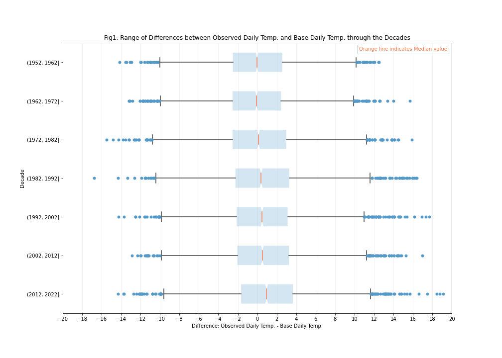
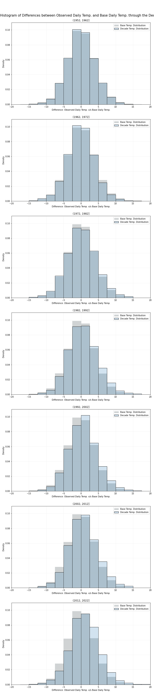

# NYC Climate Change - Analysis of Temperature Changes

This independent study analyzes daily temperature data from six NYC weather stations over a ~72 year period (1951-2022) to identify whether daily temperatures have been changing over time. The research within this project was inspired by this [NYTimes article](https://www.nytimes.com/interactive/2018/05/03/learning/08WGOITGraphLN.html) which is based on [this paper](https://www.pnas.org/doi/epdf/10.1073/pnas.1205276109) by Dr. Hansen. The research techniques within this project are guided by the methods used in the paper.

This study observed that starting from ~1982 daily temperatures in that decade are generally higher than those for the corresponding day in the base period (positive differences). We are also starting to see a general increase in the number of positive outliers, meaning unsually warm temperatures.

