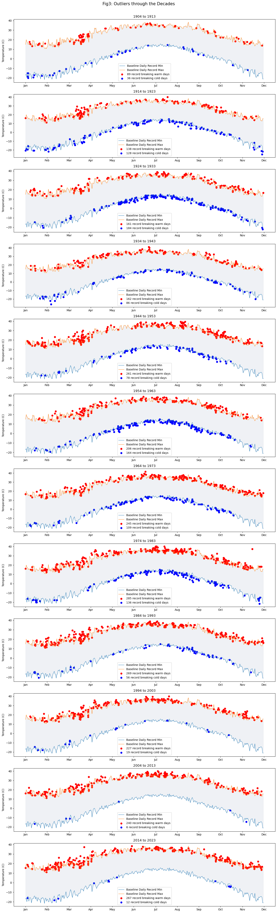
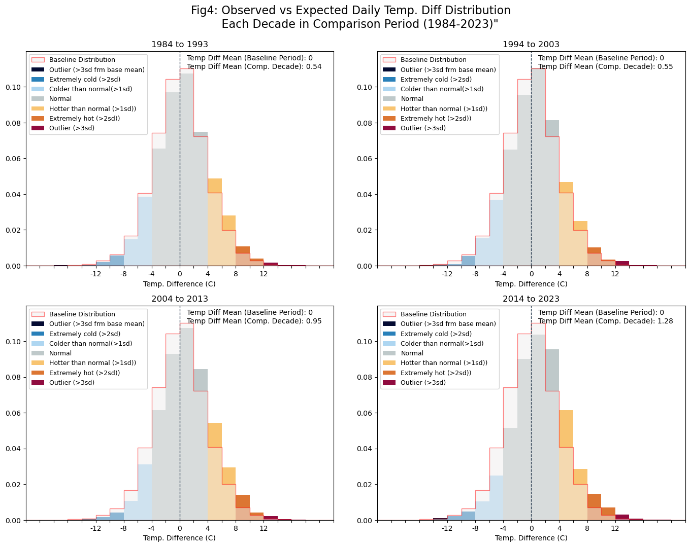

# NYC Climate Change
### A Brief Analysis of Temperature Changes and Extreme Weather Events in NYC (1870 - 2023)

This independent study analyzes daily temperature data for NYC over a 150+ year period (1870-2023) to assess whether daily temperatures have been changing over time. This study has been motivated by the World Meteorological Organization's (WMO) briefing on the [Provisional State of the Global Climate in 2022](https://public.wmo.int/en/our-mandate/climate/wmo-statement-state-of-global-climate) and by this [NYTimes article](https://www.nytimes.com/interactive/2018/05/03/learning/08WGOITGraphLN.html). The NYTimes article is in turn based on [this paper](https://www.pnas.org/doi/epdf/10.1073/pnas.1205276109) by Dr. Hansen et al., and many of the research techniques within this project are guided by the methods used in the paper. However, while the article focuses on summer temperature changes, this project focuses on temperature changes year round.

The data for this study has been obtained from the [National Oceanic and Atmospheric Administration (NOAA) website](https://www.ncei.noaa.gov/cdo-web/). The dataset contains over 150 years of daily temperature data (Jan 1,1870 - Dec 31, 2023) from between 1-32 weather stations that NOAA utilizes for New York City temperature readings. 

### Module 1: Analysis of Daily Temperature Differences - Comparison Period vs Baseline
In order to analyze temperature changes, daily observed temperatures were compared to a baseline expected daily temperatures. The Paris Climate Accord uses the pre-industrial period of 1850-1900 as its baseline per [here](https://unfccc.int/process-and-meetings/the-paris-agreement) and [here](https://www.ipcc.ch/sr15/faq/faq-chapter-1/). However, the earliest preindustrial data available for New York City is from 1870. Therefore <b>the baseline period for this study is defined from 1870 to 1903</b>. While this is shorter than the 50 year period utilized in the Paris Climate Accord, generally, a 30year or longer period would suffice as the baseline period as it is sufficiently long for meaningful statistical analysis, as explained in [this guidance](https://www.ncei.noaa.gov/access/monitoring/dyk/anomalies-vs-temperature) from NOAA. Please refer to the code file for further details on data cleaning/aggregation across stations as well as the calculation of baseline period expected temperatures.

<b>The comparison dataset for this study is from 1904 through 2023</b>. The daily temperature for each day in the comparison period are compared to the baseline temperature for that day. For example, the June 1 2022 observed temperature (Observed_T) is compared to the June 1 baseline expected temperature (Expected_T). The distribution of the differences in the observed and expected values is then analyzed; if there has not been a material change in temperatures over the years, the expectation is that these differences should be close to zero.

Each subplot within Figure 1 above, shows the <b>distribution of the differences</b> between the observed daily temperature and the expected baseline daily temperature, by decade. Bars on the right of 0 indicate positive difference, i.e., warmer observed temperatures in that decade when compared to the expected baseline daily temperatures. Similarly, the left of 0 would indicate cooler observed daily temperatures in that decade when compared to the baseline expected temperatures.

<b>The key observations:</b>
* For each decade the daily temperature differences against baseline are normally distributed, however, the distributions are moving towards the right, i.e., warmer temperatures on average. 
* In the initial decades of the 20th century, this normal distribution appears to be centered at 0, i.e, mean 0 implying on average, no differences with expected daily temperatures. But as we move through the decades, we see the normal distribution moving more to the right, i.e., more positive differences indicating warmer observed temperatures compared to expected.
* 2011 onwards, the distribution mean is closer to ~2.4 (i.e., on average, temperatures are ~2 times higher than the baseline expected temperature)
* Over the decades, there is an increase in "extremely large" positive differences, implying significantly warmer temperatures. Further analysis on extreme temperatures is shown in Figure 3.

### Module 2: Outlier Analysis -Record High/Low Temperatures outside Baseline High/Lo Record Ranges

Temperature readings extracted for each day also include the daily high and low readings. These daily readings from within the baseline period are aggregated to construct a band of possible expected maximum and minimum daily temperatures. The highest and lowest observed baseline values are utilized instead of the median to create the broadest range of baseline/expected values is created. Please refer to the code file for specifics on the calculation of this range. Observed high low daily temperatures for each day in the comparison period are then evaluated against this range with values lying outside this range considered outliers for the purposes of this study. 

<b>Key observation: As shown in Figure 2, through the decades, cooler temperature outliers decrease relative to higher temperature outliers.</b>

### Module3: Comparisons Against a More Recent Baseline Period

In the second part of this study, the baseline period was updated to 1950 to 1983. The motivations for using a more recent baseline are twofold: (1) analyses that cover "lived" in periods (either directly or via friends and family) maybe easier to connect with as well as invite introspection and discussion, and (2) it is considered to be a period of relatively stable global temperatures as outlined in the aforementioned [paper](https://www.pnas.org/doi/epdf/10.1073/pnas.1205276109) by Dr. Hansen.

While the differences decade over decade are less extreme with this updated baseline period, the general trends still remain: we still see the observed vs expected temperature difference distribution moving further to the right decade over decade as shown in Figure 3. Further, the frequency of extremely hot days (>3 std dev. above the mean) is increasing.

#### References:
https://www.pnas.org/doi/epdf/10.1073/pnas.1205276109

https://www.climate-lab-book.ac.uk/2016/how-to-quantify-changes-in-climate-extremes-without-inducing-artefacts/

https://www.nytimes.com/interactive/2018/05/03/learning/08WGOITGraphLN.html

https://www.nytimes.com/interactive/2021/climate/extreme-summer-heat.html

https://public.wmo.int/en/our-mandate/climate/wmo-statement-state-of-global-climate

#### Version Control
|Version|Date| Decription |
|:---:|:---:|:---|
|v1 |Nov 2022  |Initial Version: Analysis of data from 5 stations (Manhattan only) covering ~120 years (1901-Oct2022) |
|v2|May 2024| Revised: (1) Expanded dataset to cover all NYC boroughs (~32 stations) and to cover ~150 years (1870-2023) to overlap with preindustrial baseline period utilized in the Paris Climate Accord. (2) Updated visuals to display differences in terms of standard deviation. (3) Analysis impact of utilizing a more recent baseline period|
